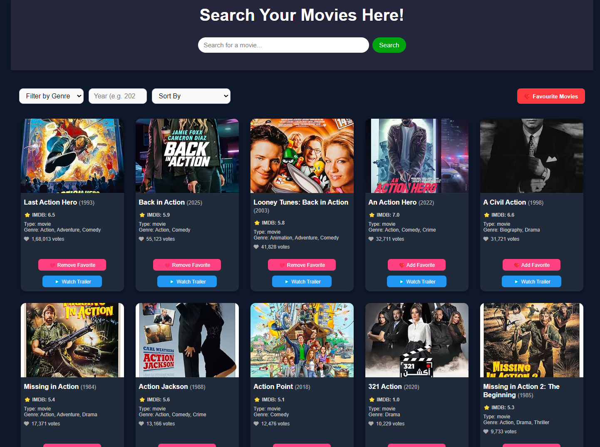
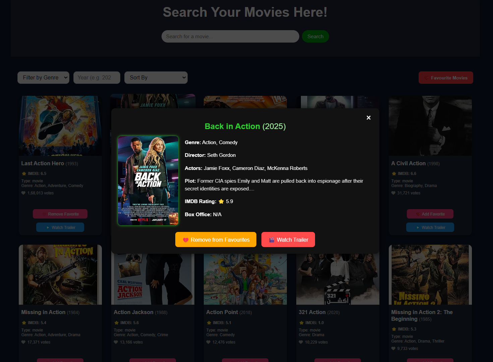
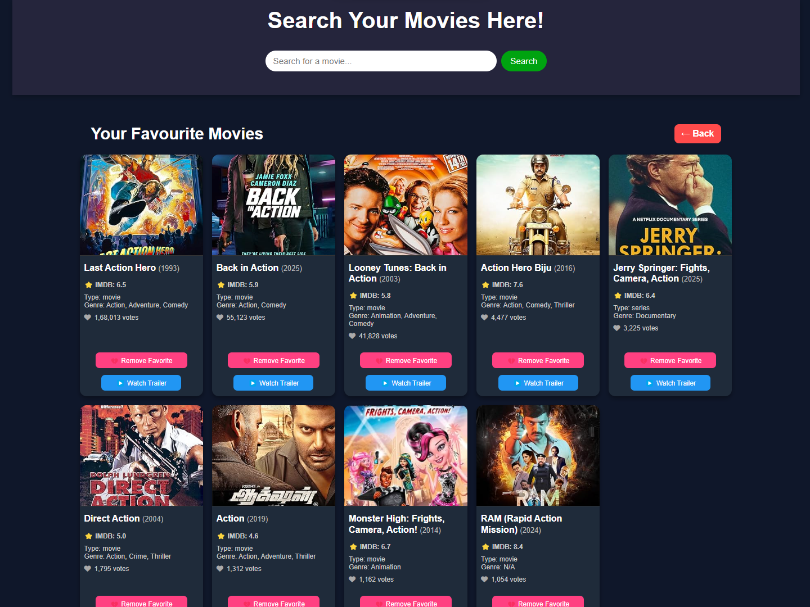
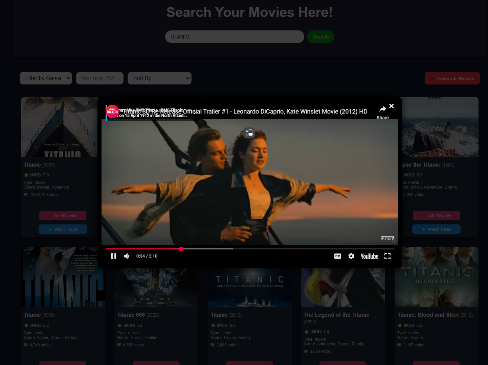

# 🎬 Movie Explorer (React)

A beautifully designed, Responsive React app to explore movies — live search, filter, sort, watch trailers, and manage favorites. Powered by OMDb and YouTube APIs, optimized for performance, accessibility, and UX.

---

## ✨ Features Overview

- 🔍 **Live Search** via OMDb API with debounce  
- 🏷️ **Filter** by Genre & Year (Client-Side)  
- 🔃 **Sort** by IMDb Rating & Year  
- 📽️ **Watch Trailers** in Modal via YouTube API  
- ❤️ **Mark as Favorite**, stored in `localStorage`  
- 📁 **Favorites Section** (persistent across sessions)  
- 🖼️ **Custom Error Screens** with fallback image  
- ⏳ **Custom Spinner** for async states  
- 📱 **Fully Responsive UI**  
- ⚛️ **Global State with Context API**  
- 🧩 **Component-based Architecture**  
- 🌐 **Clean Routing & Modular Design**  

---

## 📁 Folder Structure

MOVIE-EXPLORER-REACT/  
├── public/  
│ └── index.html  
├── src/  
│ ├── assets/  
│ │ └── errorImage.png  
│ ├── components/  
│ │ ├── FavoriteMovieGrid.jsx  
│ │ ├── Filters.jsx  
│ │ ├── Header.jsx  
│ │ ├── MovieCard.jsx  
│ │ ├── MovieGrid.jsx  
│ │ ├── MovieModal.jsx  
│ │ ├── SearchBar.jsx  
│ │ ├── Spinner.jsx  
│ │ └── TrailerModal.jsx  
│ ├── styles/  
│ │ ├── App.css  
│ │ ├── Favourites.css  
│ │ ├── Filters.css  
│ │ ├── Header.css  
│ │ ├── MovieCard.css  
│ │ ├── MovieGrid.css  
│ │ ├── MovieModal.css  
│ │ ├── SearchBar.css  
│ │ ├── Spinner.css  
│ │ └── TrailerModal.css  
│ ├── App.jsx  
│ ├── index.jsx  
│ └── MovieContext.jsx  
├── .env  
├── .gitignore  
├── package.json  
├── package-lock.json  
└── README.md  

---

## 📦 Dependencies

| Library                         | Version   | Purpose                                                  |  
|--------------------------------|-----------|----------------------------------------------------------|  
| `react`                        | ^18.2.0   | Building UI with components                              |  
| `react-dom`                    | ^18.2.0   | Mounting components to the DOM                           |  
| `react-scripts`                | 5.0.1     | Create React App scripts for build/start/test            |  
| `@testing-library/react`       | ^13.4.0   | Testing React components                                 |  
| `@testing-library/jest-dom`    | ^6.0.0    | Custom DOM matchers for Jest                             |  
| `@testing-library/user-event`  | ^14.6.1   | Simulates user interactions for testing                  |  
| `web-vitals`                   | ^2.1.4    | Collects performance metrics like FID, CLS, etc.         |

---

---

## 🛠️ Technologies Used

| Technology          | Description                                               |
|---------------------|-----------------------------------------------------------|
| **React**           | Frontend JavaScript library for building UI               |
| **JavaScript (ES6)**| Core programming language used for logic and interactivity|
| **HTML5**           | Markup language used for structuring content (as JSX in React components)              |
| **CSS3**            | Styling the app using modular component CSS               |
| **Create React App**| Official toolchain for setting up and running the React app|
| **LocalStorage**    | To persist favourite movies on client side                |
| **OMDb API**        | External movie database for fetching movie data           |            |
| **YouTube API**        | Used to fetch and embed movie trailers           |


---


## 🧠 Architecture & Technical Highlights

- ✅ **React Context API**: Central state for movies, filters, and favorites  
- 🪝 **Hooks**: useState, useEffect, useContext, useMemo, React.memo  
- 🧠 **Client-Side Caching**: Filters & sorting work instantly post initial fetch  
- 🧩 **Component-Scoped CSS**: Clean, maintainable styling per component  
- 🔐 **API Key Security**: Stored in `.env`

---

## ❗ Constraints & Design Decisions

### 🔍 No Autocomplete  
- OMDb API doesn’t support fuzzy or partial search  
- Live autocomplete would quickly exhaust free quota (1000/month)  
- TMDb API was skipped to avoid extra key/auth complexity  

### 💸 No Real Box Office Info  
- OMDb API provides limited box office data, unreliable for production  
- Paid APIs like IMDbPro or BoxOfficeMojo not used  
- **This app display fake box office information**  

### 📦 API Fetch Cap Limit  
- Max 250 movies fetched during initial load via paginated queries  
- Only 50 shown at a time, others cached for filter/sort UX  
- Fetch throttling at 1 request/sec to avoid API ban  

---

## ⚙️ Getting Started

### Prerequisites

- Node.js and npm installed  
- Valid API keys for OMDb and YouTube APIs  

### 1. Clone the repository

```bash
git clone https://github.com/Harsh31750/movie-explorer-react.git    
cd movie-explorer-react  
```

### 2. Install dependencies

```bash
npm install  
```

### 3. Add API Keys  
Create a `.env` file in the root and add your API keys:

```env
REACT_APP_API_URL=http://www.omdbapi.com/
REACT_APP_OMDB_API_KEY=your_omdb_api_key
REACT_APP_YOUTUBE_API_KEY=your_youtube_api_ke
```

Get your keys here:  
OMDb: https://www.omdbapi.com/apikey.aspx  
YouTube: https://console.cloud.google.com/apis/credentials  


### 4. Start the development server

```bash
npm start  
```

Open your browser at http://localhost:5173

### 5. Build for production

```bash
npm run build  
```

---

## 🧩 Usage & Features

- Search movies by title with live search (debounced to reduce API calls)  
- Filter movies by Genre and Year client-side instantly  
- Sort movies by IMDb rating or year  
- View movie details with plot, ratings, and metadata  
- Watch trailers embedded via YouTube in modals  
- Mark and persist favorite movies using `localStorage`  
- Responsive design for all devices  

---

## 🎯 Assumptions & Known Limitations

- Box office information is displayed fake box office information due to API limitations.
- OMDb API free tier limits requests to 1000/month — throttling implemented.  
- No autocomplete due to API limitations and quota constraints.  
- Movie data accuracy depends on OMDb and YouTube API responses.  

---

## ❓ Troubleshooting

- If movies don’t load, check your `.env` keys and internet connection.  
- API quota limits might cause temporary failures; retry later.  
- For any UI bugs, try clearing `localStorage` or refreshing the page.  

---

## 🎥 Demo Video

🔍 Live Demo

▶️ [Watch Demo on Google Drive](https://drive.google.com/file/d/1dHydpmnF0ZuyWNd201d7i2ma7vfgC96Z/view?usp=drivesdk)

---

### 🖼️ Screenshots

### 📌 Home Page  


### 🎬 Movie Detail Dialog Box  


### ❤️ Favourite Movie Section  


### 🎞️ Trailer Dialog Box  


---


## ⭐ Support

If you like this project, please ⭐ the repo and share your feedback!  

